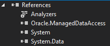

# STONE-XXI
Тестовое задание

СУБД - оракл

Язык - С#

Инструкция по сборке:
1) СУБД:
  - добавить юзера USER_MARKELOV, либо переименовать на своего в нужных местах в скриптах
  - создать таблицы
  - создать индексы (идут в скриптах таблиц после описания структуры)
  - закомпилить пакет с боди
  - запустить STONE_XXI.FILL_CURRENCY_LIB для заполнения таблицы FOREIGN_CURRENCY_MARKET_LIB данными
  - запустить STONE_XXI.FILL_CURRENCY для заполнения таблицы FOREIGN_CURRENCY_MARKET данными (дата возьмется системная, если захочется на другую - изменить sysdate на нужную)
  - запустить функцию STONE_XXI.GET_CURRENCY_ON_DATE с параметрами p_date = '28.11.2020', p_currency_charcode = 'AUD' (CHARCODE column)
  - создать джобы
  
2) Приложение:
  - установить https://www.nuget.org/packages/oracle.manageddataaccess/
  - открыть в Visual Studio .sln файл
  - убедиться, что references совпадают, добавить отсутствующие
  
    ​
  - Build
  - либо запустить через консоль экзешник, либо в VS со следующими параметрами (через пробел): 
      username password hostname port serviceName dd mm yyyy currency (пример: "STONE_XXI.exe USER USER 127.0.0.1 1521 XEPDB1 28 11 2020 AUD")
  - читать сообщения в консоли, если что-то пошло не так
